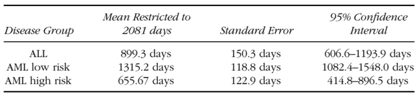

```{r message=FALSE, echo=FALSE, warning=FALSE}
# Load packages and data set
library(survival)
library(KMsurv)
library(knitr)
library(ggfortify)
data(bmt)
# Subset the data into the three groups
all <- bmt[bmt$group==1,]
low <- bmt[bmt$group==2,]
high <- bmt[bmt$group==3,]
```

# 4.1)

### Using the data reported in section 1.3, find the quantities specified below for the AML low-risk and AML high-risk groups.  Note that most of these quantities are worked out in detail in Example 4.2 and its continuations for the ALL group.   

### a) Estimate the survival functions and their standard deviations for the AML low-risk and AML high-risk groups.   

### b) Estimate the cumulative hazard rates and their standard errors for the AML low-risk and AML high-risk groups.   

### c) Provide a crude estimate of the hazard rates for each group baed on the estimates obtained in (b).   

I will do parts a), b), and c) all together.

From the data set, the time that is used is the column *t2 - Disease Free Survival Time (Time To Relapse, Death Or End Of Study)* and the event column is *d3 - Disease Free Survival Indicator  (1-Dead Or Relapsed, 0-Alive Disease Free)*.  We are studying the time until the patient is no longer disease-free, which occurs when the patient either dies or relapses.  

```{r echo=FALSE}
KM_all <- survfit(Surv(time = t2, event = d3) ~ 1, data = all)
KM_low <- survfit(Surv(time = t2, event = d3) ~ 1, data = low)
KM_high <- survfit(Surv(time = t2, event = d3) ~ 1, data = high)
```

The Kaplan-Meier estimates and their estimated standard deviation were straightforward using *R*.  The cumulative hazard functions and their standard deviations were calculated in *R* using the equations 

$$
\hat{H}(t) = 
\begin{cases}
0         & \mbox{if } t \le t_1 \\
\sum_{t_i \le t} \frac{d_i}{Y_i}  & \mbox{if } t_1 \le t
\end{cases}
$$
and
$$
\sigma^2_H(t) = \sum_{t_i \le t} \frac{d_i}{Y_i^2}
$$

The estimated hazard rates were more difficult to calculate.  The textbook mentions rates in terms of events per month.  I made a rough estimate of the number of events per month by

$$
\mbox{events per month at } t_i \approx \frac{H_{t_{i+1}} - H_{t_i}}{t_{i+1} - t_i} (30)
$$

The fraction gives a very rough estimate of events per day, and then multiplying by 30 gives the corresponding rough estiamte of events per month.  A more sophisticated approach could be used.  

$\pagebreak$ 

## The estimates for the *ALL* group:

```{r echo=FALSE}
table_maker <- function(survival_object){
  H <- cumsum(summary(survival_object)$n.event/summary(survival_object)$n.risk)
  se <- sqrt(cumsum(summary(survival_object)$n.event/(summary(survival_object)$n.risk)^2))
  all_table <- data.frame(summary(survival_object)[c(2,3,4,6,8)])
  all_table$Hhat <- H
  all_table$hsigma <- se
  all_table$slope <- rep(0, length(H))
  for(i in 1:(length(H)-1)){
    all_table$slope[i] <- 30*(H[i+1]-H[i])/(all_table[i+1, 1] - all_table[i,1])
  }
  return(all_table)
}
```

```{r echo=FALSE, eval=FALSE}
kable(table_maker(KM_all), digits = 4)
```

| $t_i$|$Y_i$ | $d_i$  | $\hat{S}(t_i)$ | $\sqrt{\hat{V}[\hat{S}(t_i)]}$ | $\widetilde{H}(t_i)$ | $\sigma_H(t_i)$ | Events/Month |
|----:|------:|-------:|------:|-------:|------:|------:|------:|
|    1|     38|       1| 0.9737|  0.0260| 0.0263| 0.0263| 0.0150|
|   55|     37|       1| 0.9474|  0.0362| 0.0533| 0.0377| 0.0439|
|   74|     36|       1| 0.9211|  0.0437| 0.0811| 0.0468| 0.0714|
|   86|     35|       1| 0.8947|  0.0498| 0.1097| 0.0549| 0.0490|
|  104|     34|       1| 0.8684|  0.0548| 0.1391| 0.0623| 0.3030|
|  107|     33|       1| 0.8421|  0.0592| 0.1694| 0.0692| 0.4688|
|  109|     32|       1| 0.8158|  0.0629| 0.2007| 0.0760| 0.9677|
|  110|     31|       1| 0.7895|  0.0661| 0.2329| 0.0825| 0.1667|
|  122|     30|       2| 0.7368|  0.0714| 0.2996| 0.0950| 0.1531|
|  129|     28|       1| 0.7105|  0.0736| 0.3353| 0.1015| 0.0258|
|  172|     27|       1| 0.6842|  0.0754| 0.3723| 0.1081| 0.0577|
|  192|     26|       1| 0.6579|  0.0770| 0.4108| 0.1147| 0.6000|
|  194|     25|       1| 0.6316|  0.0783| 0.4508| 0.1215| 0.0362|
|  230|     23|       1| 0.6041|  0.0795| 0.4943| 0.1290| 0.0296|
|  276|     22|       1| 0.5767|  0.0805| 0.5397| 0.1368| 0.0255|
|  332|     21|       1| 0.5492|  0.0812| 0.5873| 0.1449| 0.0294|
|  383|     20|       1| 0.5217|  0.0817| 0.6373| 0.1532| 0.0451|
|  418|     19|       1| 0.4943|  0.0819| 0.6900| 0.1620| 0.0347|
|  466|     18|       1| 0.4668|  0.0818| 0.7455| 0.1713| 0.0840|
|  487|     17|       1| 0.4394|  0.0815| 0.8044| 0.1811| 0.0481|
|  526|     16|       1| 0.4119|  0.0809| 0.8669| 0.1916| 0.0258|
|  609|     14|       1| 0.3825|  0.0803| 0.9383| 0.2045| 0.0435|
|  662|     13|       1| 0.3531|  0.0793| 1.0152| 0.2185| 0.0000|

An estimate of the average events per month over the first 526 days for the cumulative hazard function is 
$$
30* \frac{0.8669-0.0263}{526-1} = 0.04803429
$$

This provides a much smoother approximation than the rough approximation calcualted each day found in the table.  

$\pagebreak$

## The estimates for the *AML low-risk* group:

```{r echo=FALSE, eval=FALSE}
kable(table_maker(KM_low), digits = 4)
```

| $t_i$|$Y_i$ | $d_i$  | $\hat{S}(t_i)$ | $\sqrt{\hat{V}[\hat{S}(t_i)]}$ | $\widetilde{H}(t_i)$ | $\sigma_H(t_i)$ | Events/Month |
|----:|------:|-------:|------:|-------:|------:|------:|------:|
|   10|     54|       1| 0.9815|  0.0183| 0.0185| 0.0185| 0.0226|
|   35|     53|       1| 0.9630|  0.0257| 0.0374| 0.0264| 0.0444|
|   48|     52|       1| 0.9444|  0.0312| 0.0566| 0.0327| 0.1176|
|   53|     51|       1| 0.9259|  0.0356| 0.0762| 0.0381| 0.0231|
|   79|     50|       1| 0.9074|  0.0394| 0.0962| 0.0430| 0.6122|
|   80|     49|       1| 0.8889|  0.0428| 0.1166| 0.0476| 0.0250|
|  105|     48|       1| 0.8704|  0.0457| 0.1375| 0.0520| 0.0060|
|  211|     47|       1| 0.8519|  0.0483| 0.1587| 0.0562| 0.0815|
|  219|     46|       1| 0.8333|  0.0507| 0.1805| 0.0602| 0.0230|
|  248|     45|       1| 0.8148|  0.0529| 0.2027| 0.0642| 0.0284|
|  272|     44|       1| 0.7963|  0.0548| 0.2254| 0.0681| 0.0436|
|  288|     43|       1| 0.7778|  0.0566| 0.2487| 0.0720| 0.0077|
|  381|     42|       1| 0.7593|  0.0582| 0.2725| 0.0758| 0.0813|
|  390|     41|       1| 0.7407|  0.0596| 0.2969| 0.0796| 0.0312|
|  414|     40|       1| 0.7222|  0.0610| 0.3219| 0.0835| 0.1099|
|  421|     39|       1| 0.7037|  0.0621| 0.3475| 0.0873| 0.0132|
|  481|     38|       1| 0.6852|  0.0632| 0.3738| 0.0912| 0.1622|
|  486|     37|       1| 0.6667|  0.0642| 0.4009| 0.0951| 0.0069|
|  606|     36|       1| 0.6481|  0.0650| 0.4286| 0.0991| 0.0245|
|  641|     35|       1| 0.6296|  0.0657| 0.4572| 0.1031| 0.0140|
|  704|     34|       1| 0.6111|  0.0663| 0.4866| 0.1072| 0.0207|
|  748|     33|       1| 0.5926|  0.0669| 0.5169| 0.1114| 0.0037|
| 1063|     26|       1| 0.5698|  0.0681| 0.5554| 0.1179| 0.1091|
| 1074|     25|       1| 0.5470|  0.0691| 0.5954| 0.1245| 0.0044|
| 2204|      6|       1| 0.4558|  0.1012| 0.7621| 0.2080| 0.0000|

An estimate of the average events per month over the first 600 days for the cumulative hazard function is 
$$
30* \frac{0.4286-0.0185}{606-10} = 0.02064262
$$

$\pagebreak$

## The estimates for the *AML high-risk* group:

```{r echo=FALSE, eval=FALSE}
kable(table_maker(KM_high), digits = 4)
```

| $t_i$|$Y_i$ | $d_i$  | $\hat{S}(t_i)$ | $\sqrt{\hat{V}[\hat{S}(t_i)]}$ | $\widetilde{H}(t_i)$ | $\sigma_H(t_i)$ | Events/Month |
|----:|------:|-------:|------:|-------:|------:|------:|------:|
|    2|     45|       1| 0.9778|  0.0220| 0.0222| 0.0222| 0.0487|
|   16|     44|       1| 0.9556|  0.0307| 0.0449| 0.0318| 0.0436|
|   32|     43|       1| 0.9333|  0.0372| 0.0682| 0.0394| 0.0952|
|   47|     42|       2| 0.8889|  0.0468| 0.1158| 0.0518| 0.7500|
|   48|     40|       1| 0.8667|  0.0507| 0.1408| 0.0575| 0.0513|
|   63|     39|       1| 0.8444|  0.0540| 0.1665| 0.0630| 0.7895|
|   64|     38|       1| 0.8222|  0.0570| 0.1928| 0.0683| 0.0811|
|   74|     37|       1| 0.8000|  0.0596| 0.2198| 0.0734| 0.4167|
|   76|     36|       1| 0.7778|  0.0620| 0.2476| 0.0785| 0.2143|
|   80|     35|       1| 0.7556|  0.0641| 0.2762| 0.0835| 0.2206|
|   84|     34|       1| 0.7333|  0.0659| 0.3056| 0.0886| 0.1010|
|   93|     33|       1| 0.7111|  0.0676| 0.3359| 0.0936| 0.1339|
|  100|     32|       1| 0.6889|  0.0690| 0.3671| 0.0987| 0.1935|
|  105|     31|       1| 0.6667|  0.0703| 0.3994| 0.1038| 0.1250|
|  113|     30|       1| 0.6444|  0.0714| 0.4327| 0.1090| 0.5172|
|  115|     29|       1| 0.6222|  0.0723| 0.4672| 0.1144| 0.2143|
|  120|     28|       1| 0.6000|  0.0730| 0.5029| 0.1198| 0.0300|
|  157|     27|       1| 0.5778|  0.0736| 0.5399| 0.1254| 0.2308|
|  162|     26|       1| 0.5556|  0.0741| 0.5784| 0.1312| 0.6000|
|  164|     25|       1| 0.5333|  0.0744| 0.6184| 0.1371| 0.3125|
|  168|     24|       1| 0.5111|  0.0745| 0.6601| 0.1433| 0.0870|
|  183|     23|       1| 0.4889|  0.0745| 0.7036| 0.1498| 0.0231|
|  242|     22|       1| 0.4667|  0.0744| 0.7490| 0.1565| 0.0549|
|  268|     21|       1| 0.4444|  0.0741| 0.7966| 0.1636| 0.3000|
|  273|     20|       1| 0.4222|  0.0736| 0.8466| 0.1711| 0.0351|
|  318|     19|       1| 0.4000|  0.0730| 0.8993| 0.1790| 0.0370|
|  363|     18|       1| 0.3778|  0.0723| 0.9548| 0.1874| 0.0654|
|  390|     17|       1| 0.3556|  0.0714| 1.0136| 0.1964| 0.0586|
|  422|     16|       1| 0.3333|  0.0703| 1.0761| 0.2061| 0.0588|
|  456|     15|       1| 0.3111|  0.0690| 1.1428| 0.2166| 0.1948|
|  467|     14|       1| 0.2889|  0.0676| 1.2142| 0.2281| 0.0146|
|  625|     13|       1| 0.2667|  0.0659| 1.2912| 0.2407| 0.0481|
|  677|     12|       1| 0.2444|  0.0641| 1.3745| 0.2547| 0.0000|

An estimate of the average events per month over the first 600 days for the cumulative hazard function is 
$$
30* \frac{1.2912-0.0222}{625-2} = 0.06110754
$$

These estimates of 0.06 events per month for *AML high-risk*, 0.02 events per month for *AML low-risk*, and 0.048 events per month for *ALL* agree with what was mentioned in the textbook.   

Below is a plot of the Kaplan-Meier estimates for the three groups:

```{r echo=FALSE}
bmt$group <- as.factor(bmt$group)
plot(survfit(Surv(t2, d3) ~ group, data = bmt),
     lty = c(2, 1, 3), xlab = "Days Post Transplant",
     ylab = "Estimated Disease-Free Survival", 
     col = c("red", "blue", "black"),
     main = "Kaplan-Meier Curves")
legend("topright", c("ALL", "AML Low Risk", "AML High Risk"),
       lty = c(2, 1, 3), inset = 0.01, col = c("red", "blue", "black"))
```

$\smallskip$

And below is a plot of the estimated cumulative hazard curves for the three groups.  Note, these curves are not the Nelson-Aalen estimators $\widetilde{H}(t_i)$.  These are the transformations of the Kaplan-Meier estimates: $\hat{H}(t_i) = -ln(\hat{S}(t_i)$.  Since the sample sizes are not small and the estimators are asymptotically equivalent, these curves should look approximately like the Nelson-Aalen curves.

$\smallskip$

```{r echo=FALSE}
plot(survfit(Surv(t2, d3) ~ group, data = bmt),
     lty = c(2, 1, 3), xlab = "Days Post Transplant",
     ylab = "Estimated Cumulative Hazard", 
     col = c("red", "blue", "black"),
     main = "Estimated Cumulative Hazard Curves",
     fun = "cumhaz")
legend("bottomright", c("ALL", "AML Low Risk", "AML High Risk"),
       lty = c(2, 1, 3), inset = 0.01, col = c("red", "blue", "black"))
```

$\smallskip$

### d) Estimate the mean time to death, and find 95% confidence intervals for the mean survival time for both the AML low-risk and AML high-risk groups.   

For these calculations, I used the *stepfun()* function in *R* which creates a function object of the survival curves.  I then passed these to the function *integrate()*.  The way these step functions were created, their final value is whatever the value is at the last observation. I followed the book's example and integrated these curves from day = 0 to day = 2081 so that each mean can be compared with each other.  My results were close to the books answers.

```{r echo=FALSE}
all_function <- stepfun(summary(KM_all)$time, c(1, (summary(KM_all))$surv))
low_function <- stepfun(summary(KM_low)$time, c(1, (summary(KM_low))$surv))
high_function <- stepfun(summary(KM_high)$time, c(1, (summary(KM_high))$surv))

mean_all <- round(integrate(all_function, 0, 2081, rel.tol = 0.1)$val, 1)
mean_low <- round(integrate(low_function, 0, 2081, rel.tol = 0.1)$val, 1)
mean_high <- round(integrate(high_function, 0, 2081, rel.tol = 0.1)$val, 1)
```

```{r echo=FALSE}
est_variance <- function(surv){
  table <- summary(surv)
  surv_function <- stepfun(summary(surv)$time, c(1, (summary(surv))$surv))
  sum <- 0
  for(i in (1:length(table$time))){
    sum = sum + (((integrate(surv_function, table[[2]][i], 2081, subdivisions = 10000))$val)^2 * table[[4]][i] / (table[[3]])[i] / ((table[[3]])[i]-(table[[4]])[i]))
  }
  
  return(sqrt(sum))
}
se_all <- round(est_variance(KM_all), 1)
se_low <- round(est_variance(KM_low), 1)
se_high <- round(est_variance(KM_high), 1)
```

Here is a table of my results:  

|Disease Group | Mean Restricted to 2081 Days  |   Standard Error  | 95% Confidence Interval                                     |
|-------------:|:-----------------------------:|------------------:|------------------------------------------------------------:|
|ALL           | $`r mean_all`$                | $`r se_all`$      |[$`r mean_all -1.96*se_all`$, $`r mean_all+1.96*se_all`$]    |
|AML low-risk  | $`r mean_low`$                | $`r se_low`$      |[$`r mean_low-1.96*se_low`$, $`r mean_low+1.96*se_low`$]     |
|AML high-risk | $`r mean_high`$               | $`r se_high`$     |[$`r mean_high-1.96*se_high`$, $`r mean_high+1.96*se_high`$] |

These values are similar to the book's values:



### e) Work out estimates of the median time to death and find 95% confidence intervals for the median survival time for both the AML low-risk and AML high-risk groups using the linear, log-transformed and arcsine-square root formulas.   

These were calculated with some *R* code:

```{r echo=FALSE}
table_4_7 <- function(table){
  s_hat <- table[4]
  se_hat <- table[5]
  p <- 0.5
  linear <- (s_hat - (1 - p))/(se_hat)
  log <- ((log(-log(s_hat))-log(-log(1-p)))*s_hat*log(s_hat))/(se_hat)
  arcsine <- (2*(asin(sqrt(s_hat))-asin(sqrt(1-p)))*sqrt((s_hat)*(1 - s_hat)))/(se_hat)
  result <- round(data.frame(time = table$time, 
                     surv = table$surv, 
                     std.err = table[5], 
                     linear = linear, 
                     log = log, 
                     arcsine = arcsine), 3)
  names(result) <- c("time", "surv", "std.err", "linear", "log", "arcsine")
  return(result)
}
```

### ALL group

This is Table 4.7 in the textbook which I recreated for completeness:

```{r echo=FALSE}
kable(table_4_7(table_maker(KM_all)))
```

The estimated median is 418 days.  In the final three columns, we look for values that are between -1.96 and 1.96.  The 95% confidence intervals for the median are:

| Type         |  Interval        |
|:-------------|:-----------------|
| Linear       | [194, $\infty$]  |
| Log          | [192, $\infty$]  |
| Arcsine      | [194, $\infty$]  |

$\pagebreak$

### AML low-risk

This is the corresponding table for the group *AML low-risk*:

```{r echo=FALSE}
kable(table_4_7(table_maker(KM_low)))
```

The estimated median is 2204.  In the final three columns, we look for values that are between -1.96 and 1.96.  The 95% confidence intervals for the median are:

| Type         |  Interval        |
|:-------------|:-----------------|
| Linear       | [704, $\infty$]  |
| Log          | [641, $\infty$]  |
| Arcsine      | [641, $\infty$]  |

$\pagebreak$

### AML high-risk

This is the corresponding table for the group *AML high-risk*:

```{r echo=FALSE}
kable(table_4_7(table_maker(KM_high)))
```

The estimated median is 183 days.  In the final three columns, we look for values that are between -1.96 and 1.96.  The 95% confidence intervals for the median are:

| Type         |  Interval        |
|:-------------|:-----------------|
| Linear       | [115, 363]       |
| Log          | [113, 363]       |
| Arcsine      | [115, 363]       |

All of these confidence intervals and medians agree with those mentioned in the book.  

### f) Find 95% confidence intervals for the survival functions at 300 days post transplant for both the AML low-risk and AML high-risk groups, using the log and arcsine-square root transformed formulas.   

These were found with *R* code:

```{r echo=FALSE}
sig_squared <- function(surv, t){
  table <- table_maker(surv)
  i <- match(TRUE, table[,1] < t)
  sig_squared <- table[i, 5]^2 / table[i, 4]^2
}
```


### g) Find 95% EP confidence bands for the survival functions over the range 100–400 days post-transplant for both the AML low risk and AML high risk groups using the linear, log-transformed, and arcsine-transformed formulas.   

```{r echo=FALSE}
source(file = "conf_bands.R")
print_EP_bands <- function(band_output){
  output <- data.frame(time = band_output$time,
                       shat = band_output$surv,
                       sqV = sqrt(band_output$sigma2 * (band_output$surv)^2),
                       sigma2 = band_output$sigma2,
                       lin_low = band_output$linSL,
                       lin_hi = band_output$linSU,
                       log_lo = band_output$logSL,
                       log_hi = band_output$logSU,
                       arc_low = band_output$arcSL,
                       arc_hi = band_output$arcSU)
  return(output)
}
```

### AML low-risk

The values for $a_L$ and $a_U$ are $a_L$ = `r aLaU(low$t2, low$d3, 100, 400)[1]` and $a_U$ = `r aLaU(low$t2, low$d3, 100, 400)[2]`.  These were rounded to the nearest values found in the table.  From the table, this means that $c_{0.05} = 2.5949$.  Then some behind the scenes *R* code prints out a table similar to the table from the textbook.  Note, "L" and "R" mean the left and right endpoints of the interval.  

| $t_i$|$\hat{S}(t_i)$|$\sqrt{\hat{V}[\hat{S}(t_i)]}$|$\sigma_S^2$|Linear L|Linear R|Log L|Log R|Arcsine L|Arcsine R|
|----:|-----:|-----:|------:|-------:|------:|------:|------:|-------:|------:|
|  100| 0.889| 0.043|  0.002|   0.778|  1.000|  0.712|  0.960|   0.756|  0.974|
|  105| 0.870| 0.046|  0.003|   0.752|  0.989|  0.690|  0.949|   0.731|  0.964|
|  211| 0.852| 0.048|  0.003|   0.726|  0.977|  0.669|  0.938|   0.707|  0.953|
|  219| 0.833| 0.051|  0.004|   0.702|  0.965|  0.648|  0.926|   0.684|  0.942|
|  248| 0.815| 0.053|  0.004|   0.678|  0.952|  0.628|  0.914|   0.661|  0.930|
|  272| 0.796| 0.055|  0.005|   0.654|  0.939|  0.607|  0.901|   0.639|  0.917|
|  288| 0.778| 0.057|  0.005|   0.631|  0.925|  0.587|  0.888|   0.617|  0.904|
|  381| 0.759| 0.058|  0.006|   0.608|  0.910|  0.567|  0.875|   0.595|  0.891|
|  390| 0.741| 0.060|  0.006|   0.586|  0.895|  0.548|  0.861|   0.574|  0.877|
|  400| 0.741| 0.060|  0.006|   0.586|  0.895|  0.548|  0.861|   0.574|  0.877|

And below is a plot comparing the three confidence bands:  
$\smallskip$

```{r eval=TRUE, results='hide', echo=FALSE}
kable(round(print_EP_bands(EP.bands(low$t2, low$d3, 100, 400, 2.5949)), 3))
```
   
   
### AML high-risk

The values for $a_L$ and $a_U$ are $a_L$ = `r aLaU(high$t2, high$d3, 100, 400)[1]` and $a_U$ = `r aLaU(high$t2, high$d3, 100, 400)[2]`.  These were rounded to the nearest values found in the table.  From the table, this means that $c_{0.05} = 2.6811$.  Then some behind the scenes *R* code prints out a table similar to the table from the textbook.  Note, "L" and "R" mean the left and right endpoints of the interval.  

| $t_i$|$\hat{S}(t_i)$|$\sqrt{\hat{V}[\hat{S}(t_i)]}$|$\sigma_S^2$|Linear L|Linear R|Log L|Log R|Arcsine L|Arcsine R|
|----:|-----:|-----:|------:|-------:|------:|------:|------:|-------:|------:|
|  100| 0.689| 0.069|  0.010|   0.504|  0.874|  0.465|  0.834|   0.494|  0.854|
|  105| 0.667| 0.070|  0.011|   0.478|  0.855|  0.443|  0.817|   0.470|  0.837|
|  113| 0.644| 0.071|  0.012|   0.453|  0.836|  0.422|  0.800|   0.447|  0.819|
|  115| 0.622| 0.072|  0.013|   0.428|  0.816|  0.401|  0.782|   0.424|  0.801|
|  120| 0.600| 0.073|  0.015|   0.404|  0.796|  0.380|  0.764|   0.401|  0.783|
|  157| 0.578| 0.074|  0.016|   0.380|  0.775|  0.360|  0.745|   0.379|  0.764|
|  162| 0.556| 0.074|  0.018|   0.357|  0.754|  0.340|  0.726|   0.358|  0.745|
|  164| 0.533| 0.074|  0.019|   0.334|  0.733|  0.320|  0.707|   0.337|  0.725|
|  168| 0.511| 0.075|  0.021|   0.311|  0.711|  0.301|  0.687|   0.316|  0.705|
|  183| 0.489| 0.075|  0.023|   0.289|  0.689|  0.282|  0.667|   0.295|  0.684|
|  242| 0.467| 0.074|  0.025|   0.267|  0.666|  0.263|  0.647|   0.275|  0.663|
|  268| 0.444| 0.074|  0.028|   0.246|  0.643|  0.245|  0.627|   0.255|  0.642|
|  273| 0.422| 0.074|  0.030|   0.225|  0.620|  0.227|  0.606|   0.236|  0.621|
|  318| 0.400| 0.073|  0.033|   0.204|  0.596|  0.209|  0.584|   0.217|  0.599|
|  363| 0.378| 0.072|  0.037|   0.184|  0.572|  0.192|  0.563|   0.199|  0.576|
|  390| 0.356| 0.071|  0.040|   0.164|  0.547|  0.176|  0.541|   0.181|  0.553|
|  400| 0.356| 0.071|  0.040|   0.164|  0.547|  0.176|  0.541|   0.181|  0.553|

And below is a plot comparing the three confidence bands:  
$\smallskip$

```{r eval=TRUE, results='hide', echo=FALSE}
kable(round(print_EP_bands(EP.bands(high$t2, high$d3, 100, 400, 2.6811)), 3))
```
   

### h) Find 95% HW confidence bands for the survival functions over the range 100–400 days post-transplant for both the AML low risk and AML high risk groups using the linear, log-transformed, and arcsine-transformed formulas.   


### i) Based on the results above and those discussed in Example 4.2 and its continuations, how do the survival experiences of the ALL, AML low risk, and AML high risk groups compare?   
dfghdfgh   


# 4.2)

### A study was conducted on the effects of ploidy on the prognosis of patients with cancers of the mouth.  Patients were selected who had a paraffin-embedded sample of the cancerous tissue taken at the time of surgery.  Follow-up survival data was obtained on each patient.  

### a) Estimate the survival functions and their standard errors for both the diploid and aneuploid groups.  
dfghdfgh    


### b) Estimate the cumulative hazard rates and their standard errors for both the diploid and aneuploid groups.  
dfghfdg    


### c) Provide a crude estimate of the hazard rate for each group based on the estimates obtained in the exercise.   

dfghdfh     


### d) Provide an estimate of the mean time to death, and find a 95% confidence interval for the mean survival time for both the diploid and aneuploid groups.   
 dfhfgh    
 
 

### e) Estimate the median time to death, and find a 95% confidence interval for the median survival time for both the diploid and aneuploid groups.  
dfghfgh    


# 4.4)

### The following table contains data on the survival times of twenty-five patients with inoperative lung cancer entered on a study between November 1, 1979 and December 23, 1979.  Complete follow-up was obtained on all patients so that the exact date of death was known.  The study had on interim analysis conducted on March 3, 1980, when only 13 patients had died.  

### a) Estimate the survival function based on the available sample information at the time of the interim analysis on 3/31/80.  Provide an estimate of the standard error of your estimate.   

dfghfgh    


### b) Use the Brown, Hollandar, and Kowar technique (Practical Note 3 of section 4.2) to complete the right-hand tail of the product-limit estimate found in part a.   

dfhdffh   


### c) Using the complete follow-up on each patient, compute the estimate of the survival function and an estimate of its standard error.  Compare this estimate to that found in part a.  
  
 dfghfdgh    
 
### d) Estimate the mean time to death, restricted to 724 days, based on the product-limit estimator found in part a.   
  
dfghdfh   

### e) Estimate the mean time to death by finding the area under the survival curve found in part c.  Find the standard error of your estimate.   
  
dfghdfh   

### f) Compute the usual estimate of the time to death based on complete follow-up data by finding the arithmetic mean of the complete follow-up data. Find the standard error of this estimate in the usual way as the sample standard deviation divided by the square root of the sample size. Compare your answers to those obtained in part e.    

dfhdfh    


# Code

## 4.1)

```{r eval=FALSE}
# Code for 4.1)
```

## 4.2)
```{r eval=FALSE}
# Code for 4.2)
```

## 4.4)
```{r eval=FALSE}
# Code for 4.4)
```